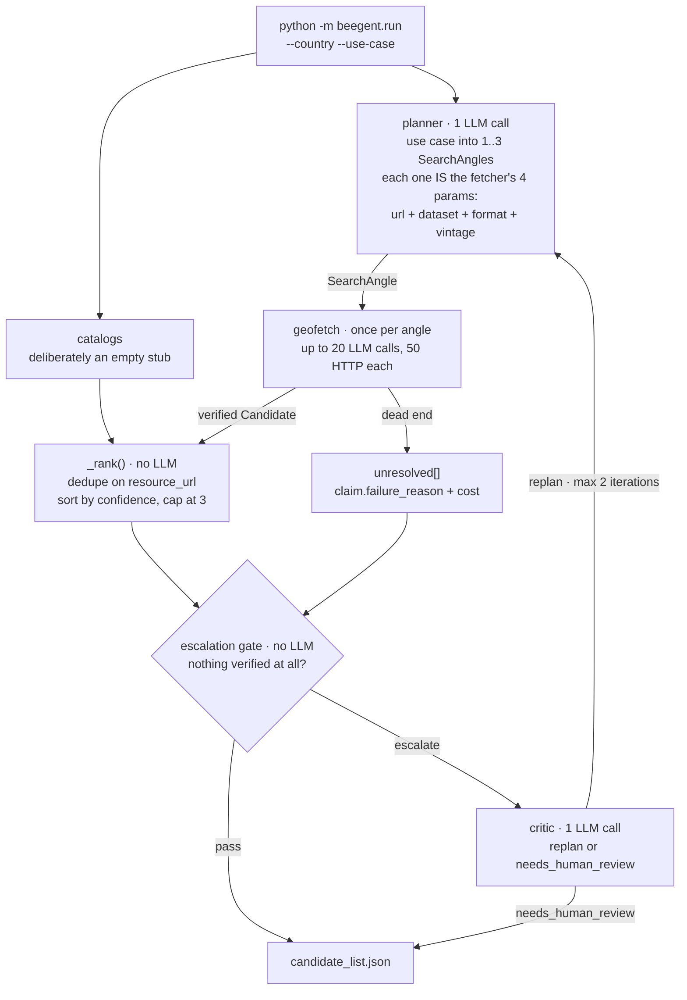

<div align="center">

#  Beegent


**Open-source multi-agent pipeline that turns a `(country, use_case)` pair into a review-ready list of candidate geospatial data sources.**

</div>

A planner, a catalog lookup, a per-angle fetch agent, and an escalation/critic loop run as
chained agents to find, **verify**, and hand off candidates — turning a day of manual
searching and tab-switching into a review-ready draft in minutes.

Every candidate that reaches the output has had its download URL independently re-probed by
the harness: the right HTTP status, and magic bytes matching the format that was asked for.
A URL the model made up, or one that only *looks* like a download, cannot get through.

Accelerates the **technical scoping** step of your ingestion process:

```
business scoping -> [technical scoping: THIS TOOL] -> dev pipeline -> validation -> deployment
```

Today that step is manual: search the internet for a country/use-case's data, open a handful
of endpoints, compare them, explore columns, define a source-to-target mapping, and write up
metadata — before the dev pipeline work can even start. This is a working prototype of that
gap-closing step, not a polished system.

## Quick start

```bash
uv sync
ollama pull deepseek-r1:14b qwen3:8b     # the default backend is local Ollama

uv run python -m beegent.run --country Kenya \
  --use-case "administrative boundaries for a flood-response dashboard"
```

Writes `candidate_list.json` (override with `--out`) and logs a run summary to stdout. Search
needs **no API key** — it is a keyless DuckDuckGo → Bing fallback chain. Databricks and other
backends: see [docs/backends.md](docs/backends.md).

## How it works



An **angle is a fetch order, not a search query**: the planner decides *where to start, which
dataset, in which format, of which vintage*. A downstream agent chases it to a file, and can only
finish by calling `report_result` — which the harness then re-probes itself before accepting.

The tools are deterministic and dumb on purpose. All the intelligence is in the model, and nothing
in the codebase knows about any specific portal, vendor or country.

## Documentation

| | |
|---|---|
| [Pipeline](docs/pipeline.md) | each stage in order, the angle contract, re-planning and the escalation gate |
| [Geofetch](docs/geofetch.md) | the agent loop diagram, its three tools, the five guardrails, small-model survival |
| [Output](docs/output.md) | `candidate_list.json` schema and the claim / verification / cost trust split |
| [Backends](docs/backends.md) | Ollama and Databricks setup, adding a connector, role→model precedence |
| [Optimizations](docs/optimizations.md) | the cost model and what was tuned per stage, with measured numbers |

## Tests

```bash
uv run python -m unittest discover -s tests -v
```

102 tests, fully offline — no network, no API key, no LLM. The agent loop is exercised by a
scripted fake model navigating a synthetic portal for a fictional country, which is also what
proves no real portal is hardcoded anywhere. Coverage includes every guardrail: an invented URL, a
wrong-format file, a premature give-up, a repeated call, and a tool call written as plain text.
