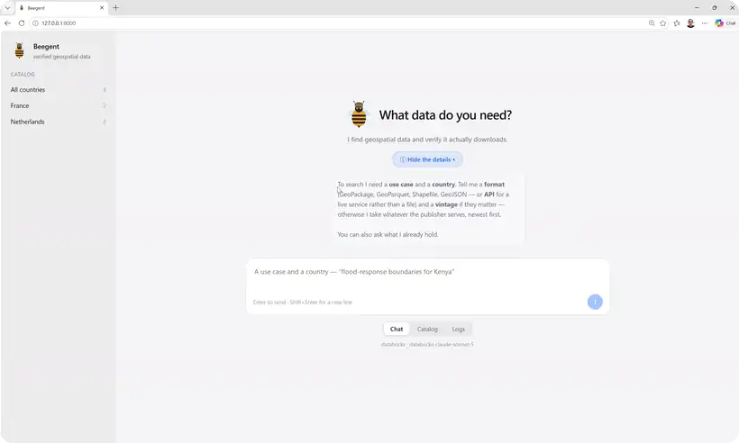

<div align="center">

#  Beegent

**Find geospatial data for any country and use case — and verify it actually downloads.**

[](https://github.com/CommanderWahid/beegent/actions/workflows/ci.yml)
[](LICENSE)
[](pyproject.toml)

[Getting started](docs/getting-started.md) ·
[Documentation](docs/README.md)

<p align="center">
  
</p>

<sub>A real run, sped up — prompt, agent, verified downloads, and the data on a map.<br/>
Discovery takes a few minutes; a repeat request is answered from memory in under a second.</sub>

</div>

---

Tell Beegent a country and what you need the data for. It plans several routes, sends an agent
down each one, and returns only the URLs it could **prove** are real — each one independently
re-fetched by the harness, with the right HTTP status and magic bytes matching the format asked
for. A URL the model invented cannot get through.

## Run it

```bash
uv sync --extra api --extra embeddings
cd ui && npm ci && npx ng build && cd ..
uv run beegent-ui                      # http://127.0.0.1:8000
```

An agent that asks what you need, a catalog of everything already verified, and the run's log
streamed live. Any verified link it can draw gets a **Show on map** button — which answers the one
thing magic bytes cannot: whether the data covers the right country.

Localhost only, and a run costs real model calls. Backend and models come from the environment or
`.env` — see [Backends](docs/backends.md). `docker compose up --build` serves the same thing with
no toolchain on the host ([details](docs/getting-started.md#in-a-container)).

### Or from the command line

The same pipeline, writing `candidate_list.json` instead of drawing it:

```bash
uv run python -m beegent.run --country France --use-case "building footprints as a geoparquet file"
```

## Why

Technical scoping is manual work: search for a country's data, open a dozen endpoints, work out
which are real, compare editions, write it up. Beegent turns that into a review-ready draft — it
does the searching, and refuses to hand you anything it could not download.

```
business scoping -> [technical scoping: BEEGENT] -> devs -> validation -> deployment
```

## How it works

It asks what it already knows first. A planner then turns your use case into distinct **angles** —
each a concrete fetch order, not a search query — and an agent chases each with three tools
(`fetch_page`, `web_search`, `probe_url`), finishing only by reporting a result the harness then
verifies itself. If nothing was verified, a critic decides whether to re-plan or ask for a human.

```
catalogs -> planner -> geofetch (per angle) -> gate -> critic -> (replan | needs_human_review)
```

Verified links are remembered, so asking again is answered from memory and re-probed rather than
rediscovered. Nothing in the codebase knows about any specific portal, vendor or country, and
**no API key is needed**: search is keyless and the default backend runs locally.

## Documentation

- [Getting started](docs/getting-started.md) — install, run it, read the result
- [Configuration](docs/configuration.md) — every setting, CLI flags, precedence
- [Backends](docs/backends.md) — Ollama, Groq, Mistral, Databricks, writing a connector
- [Architecture](docs/architecture.md) — the stages, the store, how a run flows
- [The geofetch agent](docs/geofetch.md) — the agent loop, its tools, the seven guardrails
- [Output schema](docs/output-schema.md) — `candidate_list.json`, field by field
- [Context management](docs/performance.md) — what a run costs, what memory saves
- [CONTRIBUTING](CONTRIBUTING.md) — dev setup and the test suite

## Status

**Working prototype.** It resolves real datasets on live portals and the verification guarantee
holds. Known limits:

- **No JavaScript execution** — a decision, not a gap. The agent routes *around* a JS app shell to
  the service behind it ([how](docs/geofetch.md)); a URL that only exists after a click is reported
  as an honest failure rather than guessed at.
- **It writes to `~/.beegent/memory.db`** from the first run; `BEEGENT_DB=""` disables it.
- **Results depend on the model**, and portal APIs change.

Pre-1.0: interfaces may change.

## License

[Apache 2.0](LICENSE).
