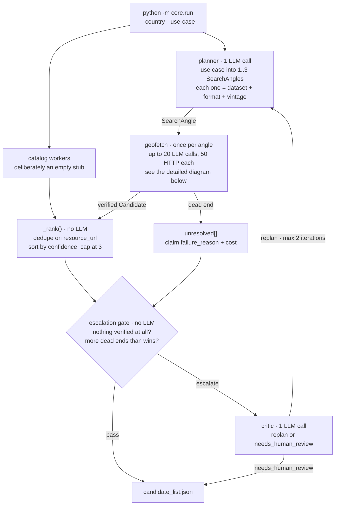
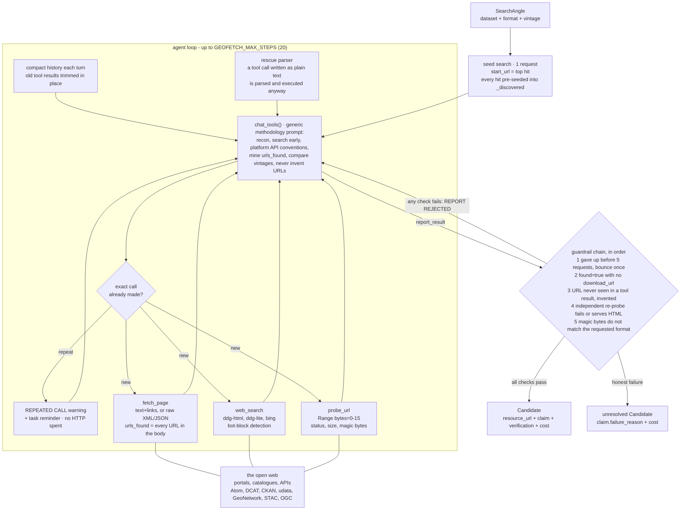

<div align="center">

#  Beegent


**Open-source multi-agent pipeline that turns a `(country, use_case)` pair into a review-ready list of candidate geospatial data sources.**

</div>

A planner, catalog workers, a per-angle fetch agent, and an escalation/critic loop run as
chained agents to find, **verify**, and hand off candidates — turning a day of manual
searching and tab-switching into a review-ready draft in minutes.

Every candidate that reaches the output has had its download URL independently re-probed by
the harness: the right HTTP status, and magic bytes matching the format that was asked for.
A URL the model made up, or one that only *looks* like a download, cannot get through.

Accelerates the **technical scoping** step of your ingestion process:

```
business scoping -> [technical scoping: THIS TOOL] -> dev pipeline -> validation -> deployment
```

Today that step is manual: search the internet for a country/use-case's data, open a handful
of endpoints, compare them, explore columns, define a source-to-target mapping, and write up
metadata — before the dev pipeline work can even start. This is a working prototype of that
gap-closing step, not a polished system.

## Architecture



An **angle is a fetch order, not a search query**: the planner decides *which dataset, in
which format, of which vintage*, and a downstream agent chases it all the way to a file. The
catalog-worker stage is a deliberate stub — the catalog layer is unbuilt. Re-planning **adds**
to the pool rather than restarting it, so a candidate verified in iteration 1 carries forward
and wins any dedupe collision against a re-found duplicate.

### Inside geofetch



The tools are deterministic and dumb on purpose — all the intelligence is in the model, and
nothing in the codebase knows about any specific portal. The system prompt teaches *method*,
not examples: look for machine-readable back-ends, learn a service's query vocabulary from one
response, compare explicit edition dates for "latest", never invent a URL.

**The model can only finish by calling `report_result`, and the harness then re-probes the
reported URL itself.** A fabricated URL cannot reach the output; the worst case is an honest
failure recorded in `unresolved`.

Guardrails 3 and 4 are **not** redundant, which is easy to miss. A URL the model invents and
then probes itself *does* enter `_discovered` — the probe result echoes it back — so only the
independent re-probe catches that one. Conversely, a URL seen on a real page but never probed
passes provenance and is caught by the probe. Each covers the other's blind spot.

### Cost

| | per unit | worst case per run |
|---|---|---|
| planner | 1 LLM call | 2 |
| geofetch | ≤20 LLM calls, ≤50 HTTP requests **per angle** | 3 angles × 2 iterations = **120 LLM calls** |
| critic | 1 LLM call | 1 |

Worth knowing before pointing this at a paid endpoint. `MAX_ANGLES` (`core/config.py`) is the
main lever. Most angles finish well short of the cap or fail early, so a real run costs less
than the ceiling — but do not budget on that. `run.totals` reports what a run *actually* spent,
and each candidate's `cost` block attributes it per angle.

## Usage

```bash
uv sync
```

**Search** is keyless — a DuckDuckGo HTML → DuckDuckGo Lite → Bing fallback chain, no API
key and no account. A paid provider was tried here and dropped: its ranking was not better
(its top hit for a real query was the file format's spec page), so it bought nothing.
There is no browser and no JavaScript execution: a JS-app portal is handled
by finding the machine-readable service *behind* the shell (Atom/DCAT feeds, CKAN/udata/
GeoNetwork/STAC API conventions, API base URLs mined out of JS bundles), which is both
cheaper and more general than driving a UI.

**Backend** defaults to Ollama running locally (`http://localhost:11434`). Pull the models
`core/config.py` expects:

```bash
ollama pull deepseek-r1:14b   # planner, critic
ollama pull qwen3:8b          # geofetch - the tool-calling agent
```

Give local models room: tool results are verbose and Ollama's default context is small.
`OLLAMA_CONTEXT_LENGTH=16384 ollama serve` — on a small context Ollama silently drops the
*oldest* messages, which are the system prompt and the task itself.

To use Databricks instead of Ollama:

1. Copy the template and fill in your workspace details:
   ```bash
   cp .env.example .env
   # then edit .env: set DATABRICKS_HOST and DATABRICKS_TOKEN
   ```
2. Set `LLM_BACKEND=databricks` — model defaults switch automatically to
   `databricks-claude-sonnet-4-6` / `databricks-claude-haiku-4-5` /
   `databricks-claude-opus-5` (planner / geofetch / critic). These must match
   serving-endpoint names in your workspace, not bare model names — check
   `GET /api/2.0/serving-endpoints` if you get a 404. Override any of `PLANNER_MODEL`,
   `GEOFETCH_MODEL`, `CRITIC_MODEL` in `.env` if you want a different model for a given step.

   The geofetch step needs **native function calling**, and is where model quality shows
   most — it is the agent that has to reason its way from a landing page to a file.

Example:

```bash
cp .env.example .env
# edit .env with your Databricks host + token

LLM_BACKEND=databricks uv run python -m core.run --country Kenya \
  --use-case "administrative boundaries for a flood-response dashboard"
```

Writes `candidate_list.json` (override with `--out`) and prints a run summary to stdout.

`url` is the page to cite; `resource_url` is the endpoint that actually serves the data. The
rest of each candidate is split by **who wrote it** — `claim` is the model's account and is
never verified, `verification` and `cost` are measured by the harness:

```json
{
  "url": "https://cartes.gouv.fr/rechercher-une-donnee/dataset/IGNF_BD-TOPO",
  "title": "BD TOPO® | cartes.gouv.fr",
  "source": "geofetch",
  "confidence": 0.95,
  "resource_url": "https://data.geopf.fr/telechargement/download/.../batiment.parquet",

  "claim": {
    "edition": "BDTOPO 3.5 - 2026-06-15",
    "vintage_date": "2026-06-15",
    "file_size_bytes": 8757357612,
    "checksum": "2a463767762cffbead6122891f31d325",
    "confidence": "high",
    "evidence": [
      "Started at https://cartes.gouv.fr/… (JS app shell)",
      "Discovered data.geopf.fr/telechargement download service",
      "Located batiment.parquet on page 2 of the edition feed"
    ]
  },

  "verification": {
    "ok": true, "status": 206, "payload_type": "parquet",
    "total_size_bytes": 8757357612, "first_bytes_hex": "50415231150415e0"
  },

  "cost": {
    "steps_used": 14, "http_requests": 22,
    "prompt_tokens": 182340, "completion_tokens": 4120, "total_tokens": 186460
  }
}
```

`first_bytes_hex` starting `50415231` is `PAR1` — the raw proof it really is a Parquet file.
`claim.evidence` is the audit trail: replay it to check the answer by hand. Cross-check
`claim.file_size_bytes` against `verification.total_size_bytes` — the first is what the
portal advertised, the second is what the server actually sent.

Angles that dead-ended are recorded under `unresolved` with `claim.failure_reason` and their
own `cost` block, so a route that burned the whole step budget is visible rather than silent.
The run object also carries `backend`, `models`, and `totals` for the whole run.

## Tests

```bash
uv run python -m unittest discover -s tests -v
```

59 tests, fully offline — no network, no API key, no LLM. The agent loop is exercised by a
scripted fake model navigating a synthetic portal for a fictional country, which is also
what proves no real portal is hardcoded anywhere. Coverage includes every guardrail in the
chain above: an invented URL, a wrong-format file, a premature give-up, a repeated call, and
a tool call written as plain text.
