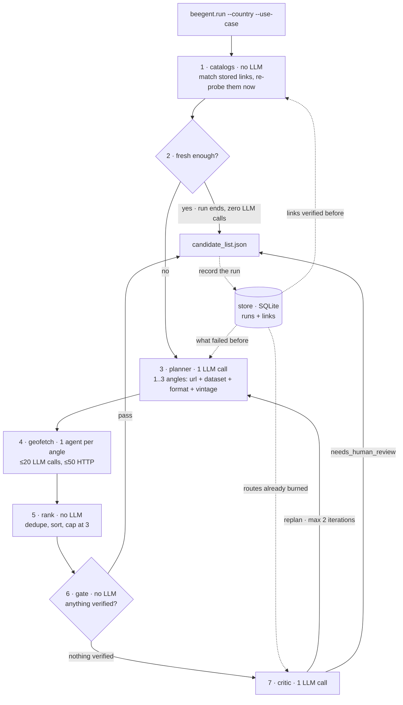

# Architecture

Seven numbered steps, only three of which call an LLM, over a store that remembers what earlier
runs learned. The loop lives in `beegent/run.py:discover()`.<br><br>



Dead ends are recorded too: an angle that finds nothing becomes an `unresolved` entry carrying the
reason and the cost, so a route that burned budget is visible rather than silent. A **stale**
catalog hit is not thrown away either — it joins the pool at step 5 as a floor.

## The stages

| | Stage | Module | LLM calls | Role |
|---|---|---|---|---|
| 1 | Catalogs | `beegent/pipeline/catalogs.py` | 0 | Links earlier runs verified, matched by cosine and re-probed now |
| 2 | Freshness | `beegent/run.py:_fresh()` | 0 | A hit within `CATALOG_FRESH_DAYS` ends the run outright |
| 3 | Planner | `beegent/pipeline/planner.py` | 1 | Turns the use case into 1–`MAX_ANGLES` search angles |
| 4 | Geofetch | `beegent/pipeline/geofetch.py` | ≤20 per angle | Chases one angle to a verified file |
| 5 | Rank | `beegent/run.py:_rank()` | 0 | Dedupes, sorts by confidence, caps the list |
| 6 | Gate | `beegent/pipeline/critic.py` | 0 | Decides whether the run needs help |
| 7 | Critic | `beegent/pipeline/critic.py` | ≤1 | Says `replan` or `needs_human_review` |

The web UI mirrors this. Its **Logs** tab shows the raw stream beside a live view of the same
pipeline — catalogs, planner, geofetch, gate, critic — with the step currently running
highlighted, so a quiet log is distinguishable from a stuck one. Freshness and rank are not shown:
they take no measurable time and emit no step of their own.

## The store

`~/.beegent/memory.db`, on by default; `BEEGENT_DB` moves it and `BEEGENT_DB=""` switches it off.
Two append-only tables, and stdlib `sqlite3` — no server, no extra dependency.

| Table | Holds | Who reads it |
|---|---|---|
| `runs` | what was tried, and the critic's verdict | the planner and the critic, both narrowed to the runs whose **use case** matches this one |
| `links` | endpoints that were independently verified | the catalog stage |

It closes a loop that used to leak: the critic's `replan` note was computed, used once and dropped,
so the most actionable thing a run produced reached neither the output file nor the next run.

`candidate_list.json` is unchanged and always written. It is the run's **deliverable**; the database
is its **memory**. Neither is a fallback for the other.

A third artifact appears only if you use the web UI: `~/.beegent/previews/` holds payloads fetched
for a map, cached exactly as the server sent them. It is a **cache** — safe to delete at any time,
and a fallback for neither of the other two. `SqliteStore.link()` exists for it, and is read by
`api/` alone.

**A fresh catalog hit ends the run before any LLM call.** A stored link that re-probes at HTTP 206
is proven *live*, not *current* — `vintage: "latest"` means a 2026 edition says nothing about 2027 —
so `CATALOG_FRESH_DAYS` (7) draws the line: inside it the catalog answers, outside it the hit is
kept as a floor and discovery still runs. Measured: a repeated request went from ~90k tokens to
**0 tokens in 0.7s**.

## An angle is a fetch order

The planner does not produce search queries. It produces the four values the fetch agent is
started with, so nothing downstream has to rediscover them:

```python
SearchAngle(
    url="https://cadastre.data.gouv.fr/data/etalab-cadastre/latest/",  # where to start
    dataset="cadastral building footprints, whole country",            # what to find
    format="GeoParquet",                                               # in which format
    vintage="latest",                                                  # which edition
)
```

`url` is the field that decides what the angle costs — a bulk file server resolves in a handful of
steps where a portal search page can burn the whole budget. See [Performance](performance.md).

An angle without a usable `url` is dropped rather than half-built. If every angle is dropped the
planner returns nothing and the run escalates to the critic.

## The escalation gate

One condition: **was anything verified at all?**

```python
not any(c.resource_url for c in candidates)
```

If a single file was independently probed, the run passes and the critic is never called. A thin
result is still a real result.

## Iterations

`MAX_ITERATIONS` (2) caps how many times the critic can send the run back to the planner.
Re-planning **adds** to the pool rather than restarting it: candidates verified in iteration 1 are
carried forward and win any dedupe collision against a re-found duplicate. They are never
re-resolved, since they already passed an independent probe.

## Failure behaviour

Every stage fails soft. A dead catalog, a failed angle, or an unparseable critic reply does not
kill the run, and the critic fails safe to `needs_human_review`. An angle whose LLM call is
throttled degrades to a dead-end record carrying its cost, rather than disappearing.

## Where to go next

- [The geofetch agent](geofetch.md) — the stage that does the work
- [Configuration](configuration.md) — `BEEGENT_DB`, `CATALOG_FRESH_DAYS`, `EMBED_MODEL`
