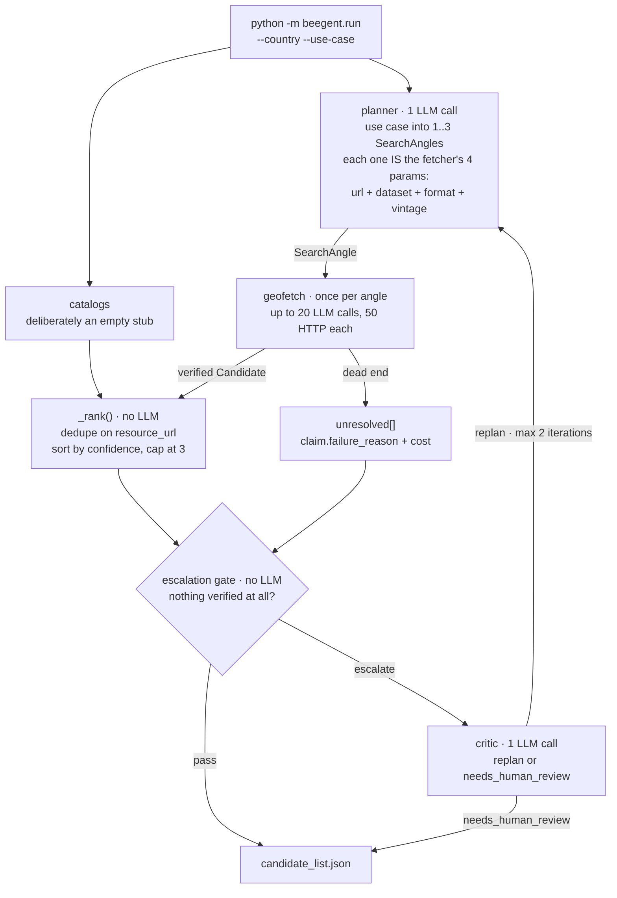

# Architecture

Beegent runs four stages in a loop. <br>
The loop lives in `beegent/run.py:discover()`.<br><br>



## The stages

| Stage | Module | LLM calls | Role |
|---|---|---|---|
| Planner | `beegent/pipeline/planner.py` | 1 | Turns the use case into 1–`MAX_ANGLES` search angles |
| Catalogs | `beegent/pipeline/catalogs.py` | 0 | An empty stub; the catalog layer is unbuilt |
| Geofetch | `beegent/pipeline/geofetch.py` | ≤20 per angle | Chases one angle to a verified file |
| Rank | `beegent/run.py:_rank()` | 0 | Dedupes, sorts by confidence, caps the list |
| Gate | `beegent/pipeline/critic.py` | 0 | Decides whether the run needs help |
| Critic | `beegent/pipeline/critic.py` | ≤1 | Says `replan` or `needs_human_review` |

## An angle is a fetch order

The planner does not produce search queries. It produces the four values the fetch agent is
started with, so nothing downstream has to rediscover them:

```python
SearchAngle(
    url="https://cadastre.data.gouv.fr/data/etalab-cadastre/latest/",  # where to start
    dataset="cadastral building footprints, whole country",            # what to find
    format="GeoParquet",                                               # in which format
    vintage="latest",                                                  # which edition
)
```

`url` is the field that decides what the angle costs — a bulk file server resolves in a handful of
steps where a portal search page can burn the whole budget. See [Performance](performance.md).

An angle without a usable `url` is dropped rather than half-built. If every angle is dropped the
planner returns nothing and the run escalates to the critic.

## The escalation gate

One condition: **was anything verified at all?**

```python
not any(c.resource_url for c in candidates)
```

If a single file was independently probed, the run passes and the critic is never called. A thin
result is still a real result.

## Iterations

`MAX_ITERATIONS` (2) caps how many times the critic can send the run back to the planner.
Re-planning **adds** to the pool rather than restarting it: candidates verified in iteration 1 are
carried forward and win any dedupe collision against a re-found duplicate. They are never
re-resolved, since they already passed an independent probe.

## Failure behaviour

Every stage fails soft. A dead catalog, a failed angle, or an unparseable critic reply does not
kill the run, and the critic fails safe to `needs_human_review`. An angle whose LLM call is
throttled degrades to a dead-end record carrying its cost, rather than disappearing.

## Where to go next

- [The geofetch agent](geofetch.md) — the stage that does the work
