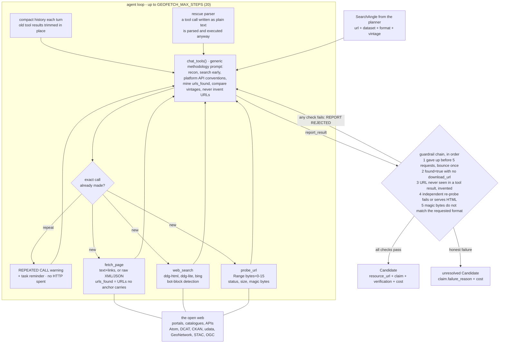

# The geofetch agent

Geofetch is the stage that does the work. One tool-calling agent runs per angle, and it is the only
part of Beegent that touches the web.

## The three tools

| Tool | Arguments | Returns |
|---|---|---|
| `fetch_page` | `url`, optional `accept` | HTML reduced to text and links; XML/JSON returned raw and truncated. Always includes `urls_found` |
| `web_search` | `query` | Results from a DuckDuckGo HTML → DuckDuckGo Lite → Bing chain, with bot-block detection |
| `probe_url` | `url` | HTTP status, total size, and the payload type identified from the first 16 bytes |

A fourth function, `report_result`, is the only way the agent can finish.

`urls_found` lists absolute URLs in the page body that the `links` list does **not** already carry
— URLs buried in prose, XML metadata, or string literals inside a JavaScript bundle. Weak models
summarise a page and miss the one URL that matters; a flat list is harder to overlook.

## What the agent is told

The system prompt teaches **method, not examples**: do reconnaissance first, search the web early,
try standard catalogue API conventions (CKAN, udata, DCAT, GeoNetwork, STAC, OGC), mine
`urls_found`, filter server-side rather than scraping, compare explicit edition dates when asked
for "latest", never invent a URL, and verify before reporting.

Nothing in it names a real portal. That is what lets the same prompt work for any country.

## No browser, no JavaScript

Beegent does not run a headless browser. A JavaScript app shell is handled by finding the
machine-readable service behind it — a `<link rel=alternate>` hint, a platform API convention on
the same host, or an API base mined out of a `<script src>` bundle.

The cost is real and worth knowing: **a download link that only exists after a client-side
interaction is unreachable**, and Beegent reports that as an honest failure rather than guessing.

## The five guardrails

The model can only finish by calling `report_result`. The harness then checks the report with
deterministic code before accepting it:

| # | Check | Rejects |
|---|---|---|
| 1 | Minimum effort | A give-up filed before 5 HTTP requests — bounced once with a checklist of untried techniques |
| 2 | URL present | `found: true` with no `download_url` |
| 3 | Provenance | A URL that never appeared in any tool result — invented, rejected even if it is live |
| 4 | Independent re-probe | A bad status, or an HTML error page served at a download URL |
| 5 | Format match | A live file of the wrong type — a GeoJSON cannot satisfy a GeoParquet request |

A rejected report is handed back to the model, which must keep searching. **A fabricated URL cannot
reach the output; the worst case is an honest failure** recorded under `unresolved`.

Checks 3 and 4 look redundant and are not — see [Design notes](design-notes.md).

## When the agent gets stuck

- **Repeated calls.** An identical tool call is answered from memory with a warning instead of
  spending HTTP budget. After `GEOFETCH_MAX_REPEATS` (3) suppressions the angle is abandoned.
- **Context pressure.** Old tool results are trimmed in place every turn so the system prompt and
  the task survive on small local context windows.
- **Malformed tool calls.** Some models stop emitting native tool calls in long conversations and
  write JSON as plain text. That is parsed, executed anyway, and the model reminded.

## Related

- [Configuration](configuration.md) — the step, request and truncation limits
- [Performance](performance.md) — what each limit costs
- [Design notes](design-notes.md) — why the guardrails are shaped this way
