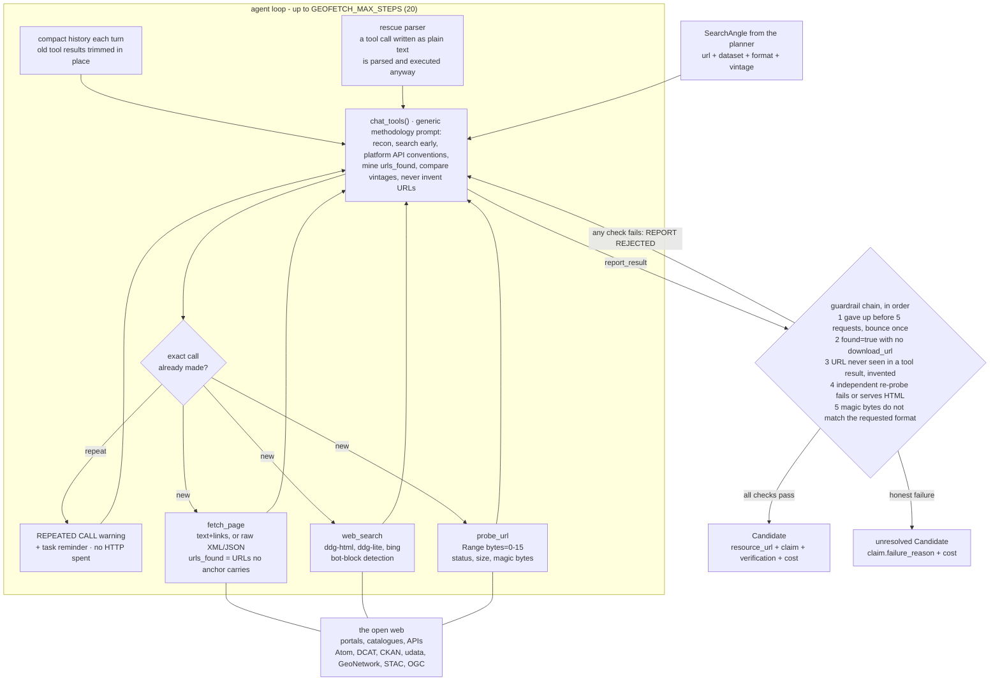

# Geofetch — the worker

One tool-calling agent per angle. It is the only stage that touches the web, and the only one that
can produce a candidate.

## The tools are deterministic and dumb on purpose

All the intelligence is in the model; nothing in the codebase knows about any specific portal.
`WebTools` (`beegent/web_tools.py`) provides three:

| tool | returns |
|---|---|
| `fetch_page(url, accept)` | HTML reduced to text + links; XML/JSON returned raw and truncated. Always carries `urls_found` |
| `web_search(query)` | keyless DuckDuckGo → DDG-lite → Bing chain, with bot-block detection |
| `probe_url(url)` | range-requests 16 bytes and names the payload from its magic bytes |

`urls_found` is the complete flat list of absolute URLs in the body that **no anchor already
carries** — prose, XML metadata, or string literals inside a JS bundle. It exists because weak
models summarize a page and miss the one URL that matters; a salient list is harder to overlook.
It is not redundant with `links`, which is HTML-only.

The system prompt encodes **method, not examples**: reconnaissance, search the web early, standard
catalogue API conventions (udata, CKAN, GeoNetwork, DCAT, STAC), mine `urls_found`, filter
server-side rather than scraping, compare explicit edition dates for "latest", never invent URLs,
verify before reporting. Nothing in it names a real portal.

## No browser, no JavaScript — a decision, not a gap

A JS-app shell is answered by finding the machine-readable service *behind* it: a
`<link rel=alternate>` hint, a platform API convention on the same host, or an API base mined out
of a `<script src>` bundle. That is cheaper, more general, and yields the download service itself
rather than one file a UI happened to expose.

The known cost: a download link that only exists after a client-side interaction is unreachable,
and is reported as an honest failure. A Playwright-based browser existed here once and was removed;
re-add it only as a fourth tool the agent escalates to, never as the default path.

## Trust but verify — the five guardrails

The model can only finish by calling `report_result`, and the harness then re-probes the URL itself
with deterministic code before accepting it. All five are load-bearing and covered by
`tests/test_geofetch.py`.

| guardrail | what it catches |
|---|---|
| **min effort** | a failure report filed before `GEOFETCH_MIN_EFFORT_REQUESTS` (5) HTTP requests — bounced once with a checklist of untried techniques |
| **no URL** | `found=true` with no `download_url` |
| **provenance** | a URL that never appeared in a tool result — invented, rejected *even if it is live* |
| **independent re-probe** | bad status, or an HTML error page served at a download URL |
| **format match** | drifting to the wrong dataset — a live GeoJSON cannot satisfy a GeoParquet request |

A rejected report is bounced back into the conversation and the agent must keep searching, so a
fabricated URL cannot reach `candidate_list.json`. The worst case is an honest failure. Every
rejection also restates the task verbatim, because by then the original task message may have been
compacted away.

### Provenance and the re-probe are not redundant

This is easy to miss. A URL the model invents and then `probe_url`s *itself* does enter
`_discovered` — the probe result echoes the URL back and every tool result is harvested — so
provenance passes for it, and only the independent re-probe rejects it. Conversely a URL seen on a
real page but never probed passes provenance and is caught by the probe. Each covers the other's
blind spot.

Small models really do this: an observed qwen3:8b run invented a fully plausible
`download.<host>/geoportal/rest/services/.../BD_TOPO_Batiments_France_GeoParquet.zip` at step 3.

## Anti-loop

An exactly repeated tool call is answered from memory with a `REPEATED CALL` warning instead of
re-spending HTTP budget. After `GEOFETCH_MAX_REPEATS` (3) suppressions the angle is abandoned — see
[optimizations](optimizations.md) for why.

## Small-model survival measures

Two things that look like clutter and are not:

- **`_compact_history()`** trims old tool results and long assistant messages *in place* every turn.
  On context overflow Ollama silently evicts the **oldest** messages — the system prompt and the
  task — so the model forgets what it is doing. That reads as a model failure but is a context
  failure.
- **`extract_inline_tool_call()`** is a rescue parser: long conversations make some models (qwen3
  among them) stop emitting native tool calls and write `{"name": ..., "arguments": ...}` as plain
  text. It is parsed, executed anyway, and the model reminded. `coerce_report_args()` does the same
  for a malformed report (`url` → `download_url`, a bare `{"error": ...}` → `found: false`).

Both exist because the default Ollama models actually do this. A rescued call goes through the same
anti-loop guard as a native one.

## Vendor neutrality is checked by construction

Nothing here may hardcode a vendor, portal hostname, or country — it has to work for any
`(country, use_case)` on earth. The whole agent loop is exercised in tests against a synthetic
portal for a *fictional* country, so anything real that crept into the harness would break them.
